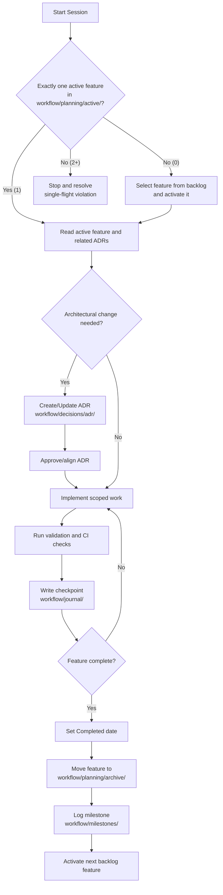
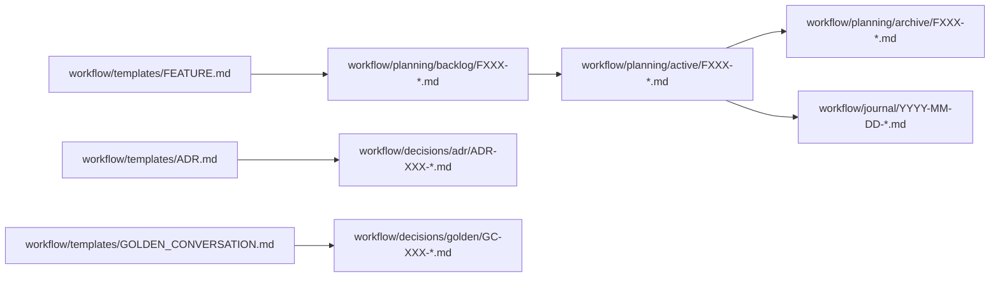

# Workflow Diagram

See setup and operational details in [instructions.md](/Users/marlin/Development/ai-workflow-template/instructions.md).

## Artifact Flow

Back to the implementation guide: [instructions.md](/Users/marlin/Development/ai-workflow-template/instructions.md).
