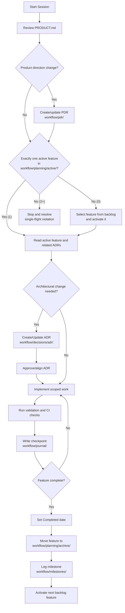
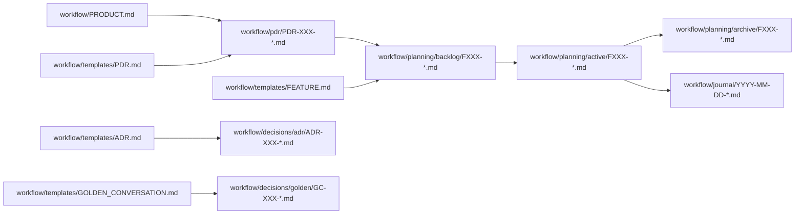

# Workflow Diagram

See setup and operational details in [instructions.md](./instructions.md).

```mermaid
flowchart TD
    A["Start Session"] --> A1["Review PRODUCT.md"]
    A1 --> A2{"Product direction change?"}
    A2 -- "Yes" --> A3["Create/update PDR<br/>workflow/pdr/"]
    A2 -- "No" --> B{"Exactly one active feature<br/>in workflow/planning/active/?"}
    A3 --> B
    B -- "No (0)" --> C["Select feature from backlog<br/>and activate it"]
    B -- "No (2+)" --> D["Stop and resolve<br/>single-flight violation"]
    B -- "Yes (1)" --> E["Read active feature and related ADRs"]

    C --> E
    E --> F{"Architectural change needed?"}
    F -- "Yes" --> G["Create/Update ADR<br/>workflow/decisions/adr/"]
    G --> H["Approve/align ADR"]
    H --> I["Implement scoped work"]
    F -- "No" --> I

    I --> J["Run validation and CI checks"]
    J --> K["Write checkpoint<br/>workflow/journal/"]
    K --> L{"Feature complete?"}
    L -- "No" --> I
    L -- "Yes" --> M["Set Completed date"]
    M --> N["Move feature to<br/>workflow/planning/archive/"]
    N --> O["Log milestone<br/>workflow/milestones/"]
    O --> P["Activate next backlog feature"]
```

## Artifact Flow

```mermaid
flowchart LR
    P["workflow/PRODUCT.md"] --> Q["workflow/pdr/PDR-XXX-*.md"]
    Q --> B["workflow/planning/backlog/FXXX-*.md"]
    A["workflow/templates/FEATURE.md"] --> B["workflow/planning/backlog/FXXX-*.md"]
    B --> C["workflow/planning/active/FXXX-*.md"]
    C --> D["workflow/planning/archive/FXXX-*.md"]
    C --> E["workflow/journal/YYYY-MM-DD-*.md"]
    F["workflow/templates/ADR.md"] --> G["workflow/decisions/adr/ADR-XXX-*.md"]
    J["workflow/templates/PDR.md"] --> Q["workflow/pdr/PDR-XXX-*.md"]
    H["workflow/templates/GOLDEN_CONVERSATION.md"] --> I["workflow/decisions/golden/GC-XXX-*.md"]
```

Back to the implementation guide: [instructions.md](./instructions.md).
